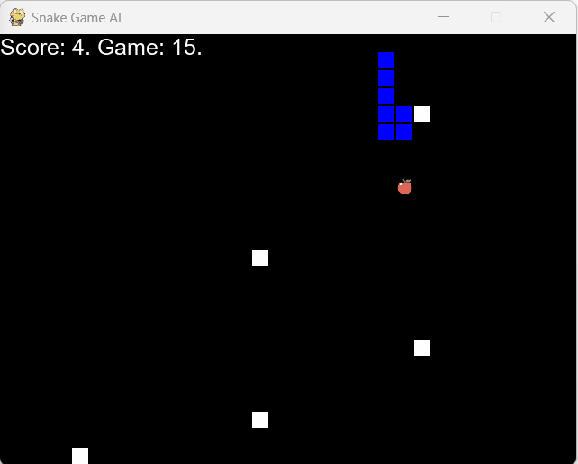

# Snake Game using Q-Learning Algorithm
## Overview

I am excited to share with you my very first Reinforcement Learning model! 


I have used for my first project of the kind a classic and old game, the Snake Game. The learning model is based on the [Q-Learning Algorithm](https://en.wikipedia.org/wiki/Q-learning). 

<p float="left", align="middle">
    
    
</p>

As it is my first time coding a python game, I was inspired by the work of Patrick Loeber and Michael Sequin. [This is the link to their version of the game and AI Model](https://github.com/python-engineer/snake-ai-pytorch). 

Although both our codes share many similarities, I have added my own touch and made major modifications both on the game environment and the AI agent.

The similarities and the differences are detailed below.


## Installation

1. Clone the repository in your target location.
2. Install the requirements.
```
pip install -r requirements.txt
```
3. Run the game.
```
python run_game.py
```

### Additional parameters:
You can set different values for some parameters (width an height of the game window, number of obstacles, ..). See the help section for more details :
```
python run_game.py --help
```
